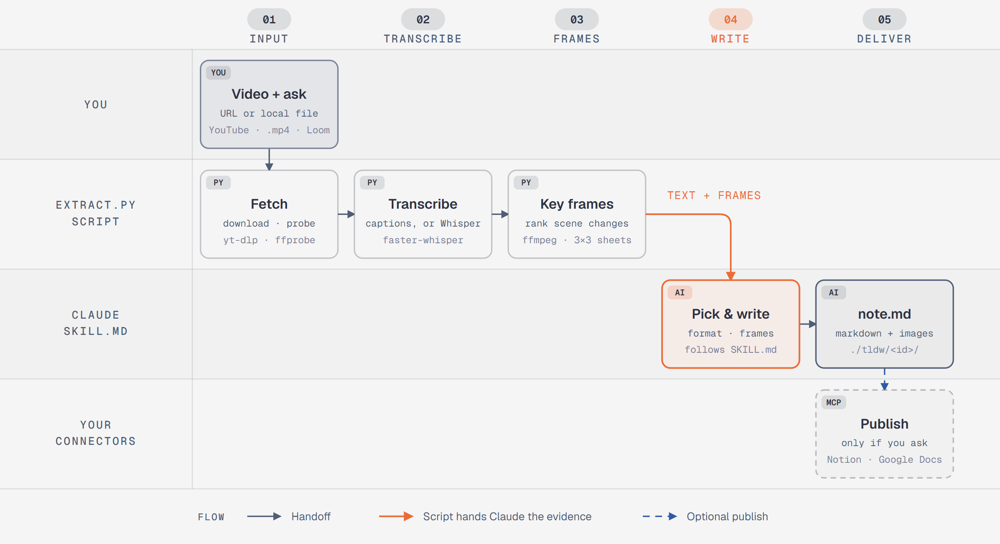

# tldw

**Too long; didn't watch.** A Claude Code skill that turns a video into a write-up with screenshots: a blog post, study notes, a how-to, or a PR description. Give it a YouTube link (or anything [yt-dlp](https://github.com/yt-dlp/yt-dlp) supports) or a local recording, and optionally have it published to Notion, Google Docs, or whatever connector you already use.

## How it works

<picture>
  <source media="(prefers-color-scheme: dark)" srcset="docs/how-it-works-dark.png">
  
</picture>

1. **Transcript.** Uses the video's captions when they exist. For raw recordings it runs [faster-whisper](https://github.com/SYSTRAN/faster-whisper) locally. No API keys.
2. **Candidate frames.** Ranks ffmpeg scene changes instead of using a fixed threshold, so small UI changes in screen recordings aren't missed the way a slide-deck threshold would miss them.
3. **Contact sheets.** Tiles the candidates 9 per image with `#n mm:ss` labels, so Claude can review ~40 frames cheaply, pick the ones that show each step, and grab an exact frame from a transcript timestamp when a candidate is missing.
4. **Write-up.** Picks the format that fits the video (or the one you ask for) and writes `note.md`.
5. **Publish.** Uses the tools Claude already has connected. There is no integration code in this repo.

## Requirements

- [Claude Code](https://claude.com/claude-code)
- Python 3.10+
- `ffmpeg` and `ffprobe` on `PATH`
- `yt-dlp` on `PATH` (for URLs only)
- [`uv`](https://docs.astral.sh/uv/) (for videos without captions only; it installs faster-whisper on demand)

## Install

As a plugin:

```
/plugin marketplace add Joy9001/tldw
/plugin install tldw@tldw
```

Or copy or link `skills/tldw` into `~/.claude/skills/`.

## Use

Ask Claude Code things like:

- "Turn https://youtu.be/... into a blog post"
- "Write a how-to from ./recording.mp4 and put it in Notion"
- "PR description from this screen recording: demo.mov"

Output goes to `./tldw/<id>/`: `note.md`, `transcript.txt`, `meta.json`, `frames/`, `sheets/`.

## Transcription

When there are no captions, the script exits with code 3 and prints a `uv run --with faster-whisper ...` command, which Claude runs. The first run downloads the Whisper model (~500 MB). If an NVIDIA GPU is detected, the command also pulls NVIDIA's CUDA libraries (~1 GB) from PyPI and transcription runs on the GPU; otherwise it uses the CPU.

Measured on a 6.5-minute screen recording: about 2 minutes end to end on a GTX 1650, under 4 minutes on CPU.

A `.vtt` or `.srt` file next to a local video is used instead of Whisper.

## The extraction script on its own

```
python skills/tldw/scripts/extract.py <url-or-file> [--out DIR] [--model small] [--max-frames N]
```

Exit codes: `0` ok, `2` bad input or missing tool, `3` needs Whisper.

Self-check (needs ffmpeg, no network):

```
python skills/tldw/scripts/test_extract.py
```

## Notes

- Meant for your own recordings, and for personal notes on other people's videos. Respect creators' rights and the terms of the sites you download from.
- Developed and tested on Windows 11. The script is cross-platform, but the GPU setup has only been tested on Windows.

## License

MIT
